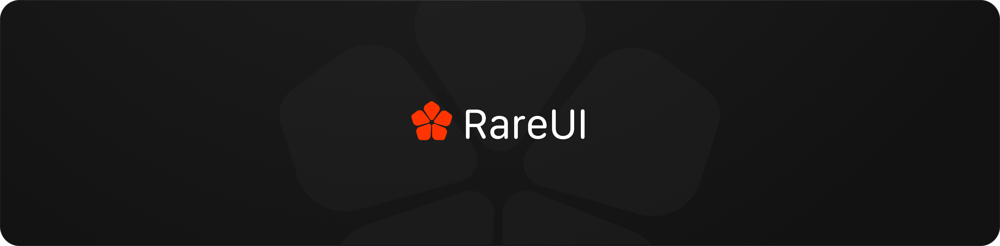
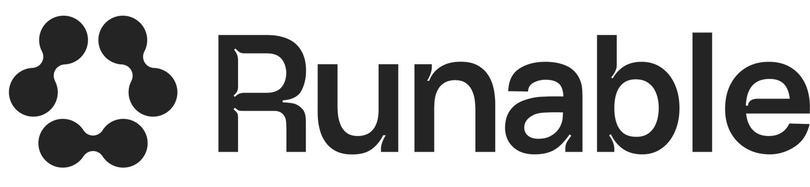
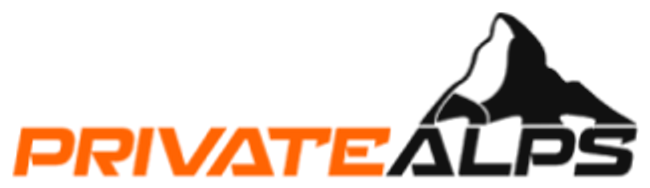

<div align="center">
  <a href="https://rareui.com">
    
  </a>
</div>

<div align="center">

**A shadcn registry of rare, ready-to-use components and animations.**


[**rareui.com**](https://rareui.com) &nbsp;&middot;&nbsp; [Components](https://rareui.com/components) &nbsp;&middot;&nbsp; [Follow on X](https://x.com/swamimalode)

</div>

<br />

Rare UI is a shadcn registry built with Next.js, Tailwind CSS, and TypeScript. Every component is animated with Motion, honors `prefers-reduced-motion`, and installs straight into your codebase. You own the code: no package to depend on, restyle anything.

## Sponsors

<table align="center">
<tr>
<td align="center" width="340">
  <a href="https://runable.com/?utm_source=rareui&utm_medium=referral&utm_campaign=readme">
    <picture>
      <source media="(prefers-color-scheme: dark)" srcset="public/logos/runablewhite.png" />
      
    </picture>
  </a>
  <br />
  <sub>Diamond Sponsor</sub>
</td>
<td align="center" width="340">
  <a href="https://privatealps.net/?utm_source=rareui&utm_medium=referral&utm_campaign=readme">
    <picture>
      <source media="(prefers-color-scheme: dark)" srcset="public/logos/privatealpswhite.png" />
      
    </picture>
  </a>
  <br />
  <sub>Diamond Sponsor</sub>
</td>
</tr>
</table>

Rare UI is free. Sponsorship keeps it that way. See the tiers at [rareui.com/sponsors](https://rareui.com/sponsors).

## Quick start

Install any component with the shadcn CLI:

```bash
npx shadcn@latest add swamimalode07/rare-ui/{component-name}
```

For example:

```bash
npx shadcn@latest add swamimalode07/rare-ui/fluid-orb
```

Browse every component, with live previews and props, at [rareui.com/components](https://rareui.com/components).

## Running locally

```bash
git clone https://github.com/swamimalode07/rare-ui.git
cd rare-ui
npm install
npm run dev
```

Components live in `components/ui`. After changing a component or `registry.json`, rebuild the registry output with `npm run registry:build`.

## Contributing

Issues and pull requests are welcome. Read [CONTRIBUTING.md](CONTRIBUTING.md) for the full walkthrough, from creating a component to a working install command.

## License

MIT with the [Commons Clause and an attribution requirement](LICENSE). Use, modify and ship the components in anything you build, personal or commercial, closed source included.

Credit is required. Any project shipping a Rare UI component must credit Rare UI with a visible link to [rareui.com](https://rareui.com), in a footer, an about page, a credits screen or a README, and must keep the credit and copyright notice in the source it copied.

You may not sell, sublicense or redistribute the components themselves, alone, in a bundle, or ported to another framework.

The name Rare UI, the logo and the site design are not covered by the license.

<div align="center">
  <br />
  
  <p><sub>Built by <a href="https://x.com/swamimalode">@swamimalode</a></sub></p>
</div>
